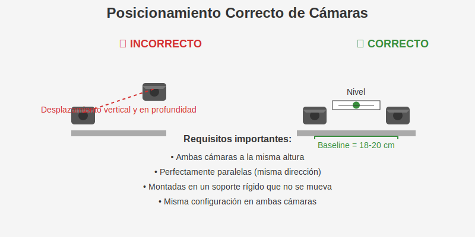
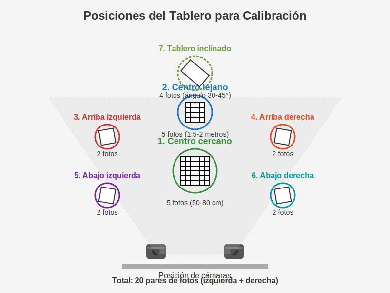
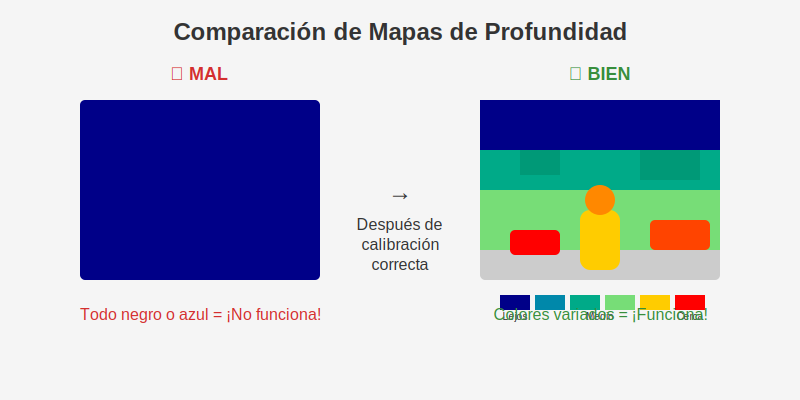

# Problema y Solución para la Calibración de Cámaras GoPro

## 😱 ¿Cuál es el problema?

Las cámaras están mal colocadas:
- No están una al lado de la otra
- Una está más alta que la otra
- Una está más adelante que la otra

Por esto, las fotos no se pueden combinar bien y el mapa de profundidad sale todo negro o azul.

## 👍 ¿Cómo arreglarlo?

### 1. Colocar las cámaras correctamente



- Poner las cámaras exactamente una al lado de la otra
- A la misma altura (usar un nivel)
- Apuntando en la misma dirección
- Separadas por 18-20 cm
- Montadas en algo firme que no se mueva

### 2. Preparar el tablero de ajedrez

- Imprimir el tablero de 8x8 cuadros
- Pegarlo en cartón duro o madera (¡debe ser plano!)
- Cada cuadrado debe medir unos 3 cm

### 3. Tomar las fotos para calibración (¡Muy importante!)

#### Paso a paso:

1. **Crear carpetas** para guardar las fotos:
   - `data/calibration/left` (cámara izquierda)
   - `data/calibration/right` (cámara derecha)

2. **Tomar 20 pares de fotos** del tablero en estas posiciones:

   

   - **5 fotos: Tablero en el centro cercano** (a 50-80 cm)
   - **5 fotos: Tablero en el centro lejano** (a 1.5-2 metros)
   - **2 fotos: Tablero arriba a la izquierda**
   - **2 fotos: Tablero arriba a la derecha**
   - **2 fotos: Tablero abajo a la izquierda**
   - **2 fotos: Tablero abajo a la derecha**
   - **4 fotos: Tablero inclinado** (ángulo de 30-45°)

3. **Consejos importantes**:
   - El tablero debe verse COMPLETO en ambas cámaras
   - Buena luz, sin sombras ni brillos
   - Tomar cada par de fotos al mismo tiempo
   - Revisar que las fotos estén claras
   - Nombrar las fotos: `left1.jpg`, `right1.jpg`, etc.

### 4. Ejecutar la calibración

```
python -m calibration.gopro_calibration --left_imgs "data/calibration/left/*.jpg" --right_imgs "data/calibration/right/*.jpg" --output_dir results --baseline 184 --debug
```

Si todo salió bien, el error debe ser menos de 1.0 ¡y no 136!

## ✅ ¿Cómo saber si funcionó?

El mapa de profundidad tendrá colores:
- Objetos cercanos: amarillo/rojo
- Objetos lejanos: azul/verde



¡Listo! Ahora las cámaras pueden ver en 3D como nuestros ojos. 👀